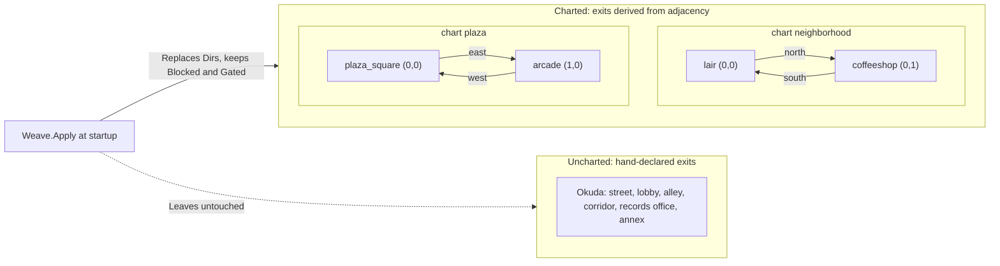
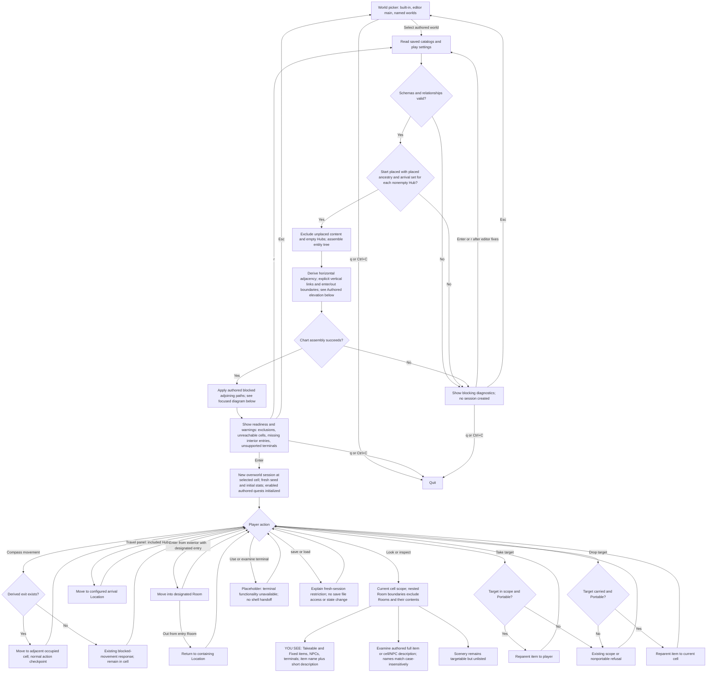
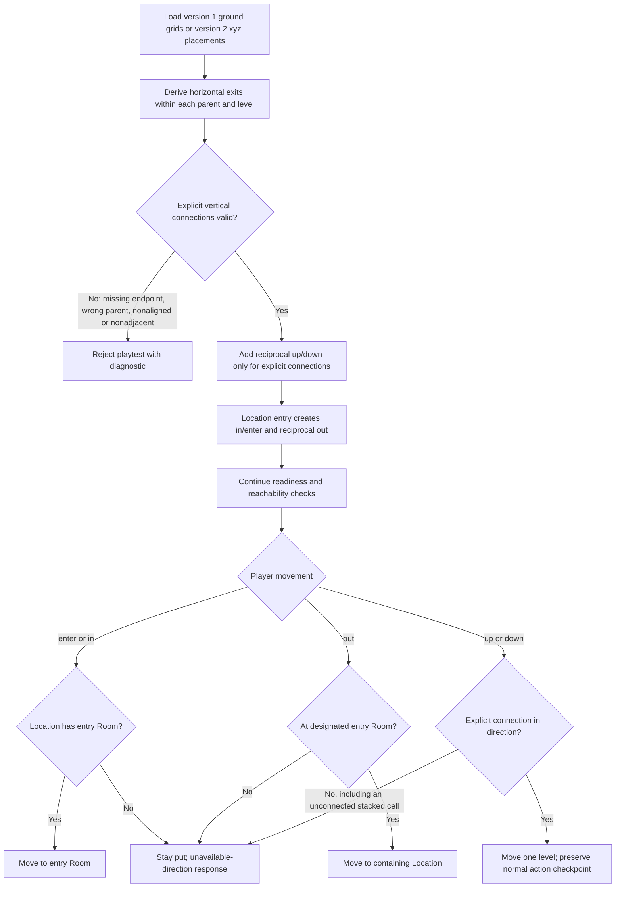
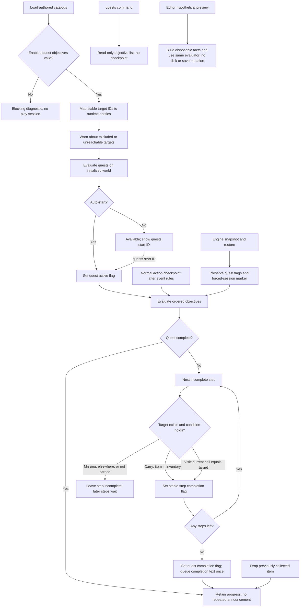
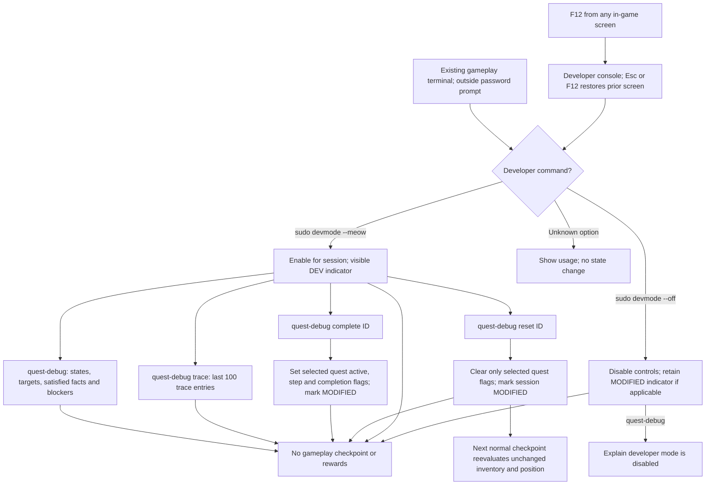
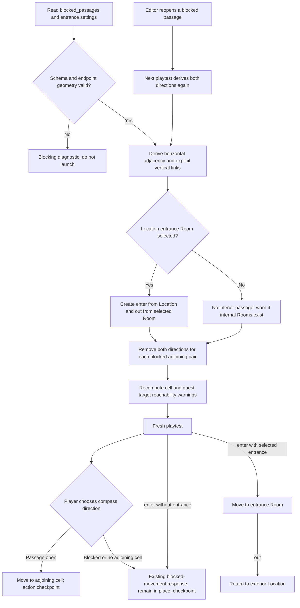

# Game Flow

This is the canonical code-derived map of implemented game behavior. Update
it in the same change as any game-logic change. Solid arrows represent
required state transitions; dashed arrows represent optional actions or
knowledge-based shortcuts that the runtime permits.

```mermaid
flowchart TD
    subgraph Startup[Startup and mission bootstrap]
        Boot([Program starts]) --> WorldPicker{Startup world picker}
        WorldPicker -->|Built-in game| Geometry[NewWorld applies the chart weave; see Geometry below]
        WorldPicker -->|Authored world| AuthoredLoad[Load saved catalogs; see Authored world playtests below]
        AuthoredLoad -.-> QuestRuntime[Authored quests and developer inspection; see focused diagrams below]
        Geometry -.->|Malformed or unknown-entity chart| ChartBug[Content bug queues on Pending as a story-beat modal]
        Geometry --> Deck[BootIntoDeck opens the deck terminal]
        Deck --> Note[use_the_messenger.md is present]
        Deck --> Welcome[marduk welcome message is unread]
        Note -.-> ReadNote[cat use_the_messenger.md]
        ReadNote -.-> OpenMessenger[Run messenger or talk]
        Welcome --> OpenMessenger
        Deck -->|Bootstrap note may be skipped| OpenMessenger
        OpenMessenger --> MissionFlag[Set mission_microslop]
        MissionFlag --> NoteSwap[Bootstrap note disappears]
        MissionFlag --> MissionFile[Mission 1 file appears in notes]
    end

    subgraph Credential[Microslop credential]
        Deck --> Exit[exit or logout]
        Exit --> Lair[Buddy's Lair]
        Lair --> Coffee[Go north to the Coffee Shop]
        Coffee --> Route{Post-it approach}

        Route -->|Charm| Purr[Purr with Charm at least 8]
        Purr --> Softened[Set barista_softened]
        Softened --> NotBurned{barista_burned absent?}
        NotBurned -->|Yes| Examine[Look, read, or examine post-it]
        NotBurned -->|No| Sneak

        Route -->|Cruel dialogue choice| TipJar[Knock over tip jar]
        TipJar --> Burned[Set barista_burned]
        Burned --> Sneak[Sneak post-it at difficulty 22]

        Route -.->|Optional setup| Mug[Knock espresso machine mug]
        Mug -->|One check gets +4| Sneak
        Route -->|Stealth| Sneak
        Sneak -->|Success| Badge[Set read_microslop_badge]
        Sneak -->|Failure| Burned
        Examine --> Badge
        Badge --> Intel[Notes expose username jane_doe, employee 1008476, and password apple]
    end

    subgraph Mission1[Microslop delivery]
        Intel --> Return[Return south to the lair]
        Return --> UseDeck[use deck]
        UseDeck -.-> Scan[scan microslop]
        Scan -.-> SSH[ssh jane_doe@microslop]
        UseDeck --> SSH
        Deck -.->|Player already knows jane_doe and apple| SSH
        UseDeck -.-> BareSSH[ssh microslop]
        BareSSH --> UserRequired[(Placeholder) username required; remain on deck]
        SSH --> Password[Masked password prompt; enter apple]
        Password -->|Username and password match| Connected[Connected as jane_doe; main terminal turns amber]
        Password -->|Either credential is wrong| Denied[Permission denied; remain on green deck terminal]
        Connected -.-> Search[grep -ir 1008476 /]
        Search --> Target["/srv/hr/rif_q3.txt"]
        Target -.-> ReadPlans[cat file sets read_layoff_plans]
        ReadPlans -.-> CopyPlans[Copy file to deck]
        Target -->|Reading is not required| CopyPlans
        CopyPlans --> GotPlans[Set got_layoff_plans]
        GotPlans --> Send[send deck copy]
        Send --> Delivered[Set layoff_plans_delivered]
        Delivered --> Reply[marduk reply arrives]
        Reply --> Complete[Mission file renders Mission complete]
        Connected -.-> RemoteExit[exit or logout]
        RemoteExit --> DeckTheme[Return to deck prompt; main terminal turns green]
    end

    subgraph Independent[Independent executable branches]
        Exit --> Hubs[All hubs are travelable]
        Hubs --> Plaza[Plaza and arcade exploration]
        Hubs --> Okuda[Okuda HQ]

        Okuda -->|Lobby Charm| Office[Records Office]
        Okuda -->|Fire escape and corridor checks| Office
        Office --> Port[Use console; set okuda_port_open]
        Port --> OkudaHost[Return to deck; ssh okuda.grid]
        OkudaHost --> Read410[Read vault 410 file]
        OkudaHost --> Unlock[Run unlock.bin]
        Unlock --> AnnexFlag[Set okuda_annex_unlocked]
        AnnexFlag --> Annex[Enter Deep Archive]
        Annex --> ArchiveStub[(Placeholder: archive content)]

        Deck --> Sunfarm[ssh sunfarm.arc]
        Sunfarm --> Whisper[Read burial.log]
        Sunfarm --> Fragment[Copy sun.frag]
        Sunfarm --> Dig[Run dig.bin]
        Sunfarm --> Silence[Kill whisperd]
        Whisper --> SunEvents[Derived messages, notes, and logout XP]
        Fragment --> SunEvents
        Dig --> SunEvents
        Silence --> SunEvents

        Connected -.-> Notice[Read or copy sun_notice.txt]
        Notice --> NoticeEvents[Derived message, notes, and logout XP]
    end
```

## Geometry: charted exits

Room-to-room directions are not all declared the same way. `NewWorld` loads
`internal/game/content/charts.json` and calls `Weave.Apply`, which **replaces**
the `Dirs` of every charted room with directions derived from lattice
adjacency. Uncharted rooms keep their hand-declared exits. Authored `Blocked`
prose and `Gated` locks survive the replacement on both paths, so geometry
decides which directions exist and content decides what happens on the way
through.

Charted cells and the exits they derive (`neighborhood` and `plaza`; north is
`Y+1`, east is `X+1`):



Properties this section pins:

- Every derived edge is reciprocal: a lattice step and its reverse are always
  installed as a pair, and `Glue` refuses a declaration whose forward or
  return face is already claimed by a different target. Scrambled geometry is
  unrepresentable rather than merely discouraged.
- A cell naming an entity absent from the world, a duplicate chart id, or an
  unparseable file becomes a queued content bug, not a panic. Those bugs reach
  the player through the same story-beat modal surface as events.
- Cross-chart gluings are implemented, but `charts.json` currently declares
  none; both charts are self-contained.
- **Okuda is deliberately uncharted.** Its six rooms are not realizable on a
  lattice as currently wired — the guard's passage joins the corridor and the
  office, which the other exits force diagonal. Charting it means adding a
  room, moving one, or re-routing the guard, all content decisions. Charted
  and hand-wired rooms coexist by design; see `docs/systems/charts.md`.

## Runtime properties exposed by the diagram

- The bootstrap note and `scan microslop` are guidance, not gates.
- `read_microslop_badge` does not gate SSH; knowing `jane_doe` and `apple`
  bypasses the coffee-shop route.
- `mission_microslop` does not gate the target file or its hooks, so the
  delivery flags can land before the briefing is read.
- Okuda, sunfarm, and Plaza behavior is independently reachable rather than
  part of Mission 1.
- The Deep Archive is reachable, but its terminal content remains a marked
  placeholder in code.
- The `lair → coffeeshop` and `plaza_square → arcade` edges drawn above are
  derived from `charts.json` at startup, not hand-declared; Okuda's are
  hand-declared. See [Geometry: charted exits](#geometry-charted-exits).


## Authored world playtests

Implemented by `cmd/pawsinthemachine/startup.go`, `internal/game/authored.go`,
and the engine/UI authored-content components. The startup overview above
links here. Authored selection loads files at selection/retry time; entering
play uses that prepared snapshot. Each restart or reload builds fresh state.
The editor's `charts.json` is not used in this path: charts derive from UUID
placements, while the built-in game retains its existing chart file.



Room boundaries affect only entities carrying `engine.RoomBoundary`; ordinary
open/closed container scope is unchanged. The nested Room itself is excluded
from exterior targeting, as are its contents. Authored NPCs have description
and visibility components only; dialogue continues to require authored logic.
No missing passages or prose are generated to make draft cells reachable.

Editor configuration writes do not mutate a running session. World Overview
sets or clears the starting Location/Room; Hub Details sets or clears an arrival
Location. Both settings require placed ancestry. Referenced cells and their
ancestors cannot be deleted or unplaced until the dependent setting is cleared.
Missing settings are permitted during authoring and block only play launch.

## Authored elevation and interior boundaries

User ruling 2026-09-07. Applies to editor-authored worlds; the built-in demo
retains its chart behavior. Executed by `game.AssembleAuthored` and engine movement.



The 2026-09-07 ambient population uses the existing authored item branches
(take/drop for takeable items; examination for all item kinds), descriptive NPC
examination, and the existing unsupported-terminal response. No mission or flag
transitions were added. Exact entities and placements are in
[the draft review](WORLD_DRAFT_REVIEW.md). Lowtown now has Megarise 7 as its arrival
Location, enabling its existing Hub travel branch.

## Authored quests and developer inspection

Implemented by `internal/engine/quests.go`, `internal/game/authored.go`,
`internal/ui/quest_debug_ui.go`, and the terminal's `ExecDetailed` dispatch.
The authored loader uses enabled `quests.json` definitions; drafts are omitted.
The existing built-in mission remains independent and unchanged.



Visit conditions use exact cell identity: occupying an interior Room does not
also satisfy a visit to its exterior Location. Already-satisfied objectives
can complete together in list order. Completion is sticky. The existing
restriction on saving/loading authored playtest sessions remains in place;
engine save snapshots support quest flags for save-enabled sessions.



Unknown quest IDs and malformed debugger commands report errors without
mutation. Developer enablement is not saved. Forced progress is identified
in snapshots by optional `dev_modified`, compatible with existing saves.
The cup demo starts at world initialization, remains blocked until the
existing Paper Cup is carried, then completes once without XP or item removal.

### Authored entrances and blocked adjoining paths

`internal/content/blocked_passages.go` validates static wall endpoints;
`AssembleAuthored` removes both corresponding compass exits before calculating
reachability. A missing catalog preserves default adjacency. This affects only
authored worlds. Existing built-in charts and mission paths are unchanged.


