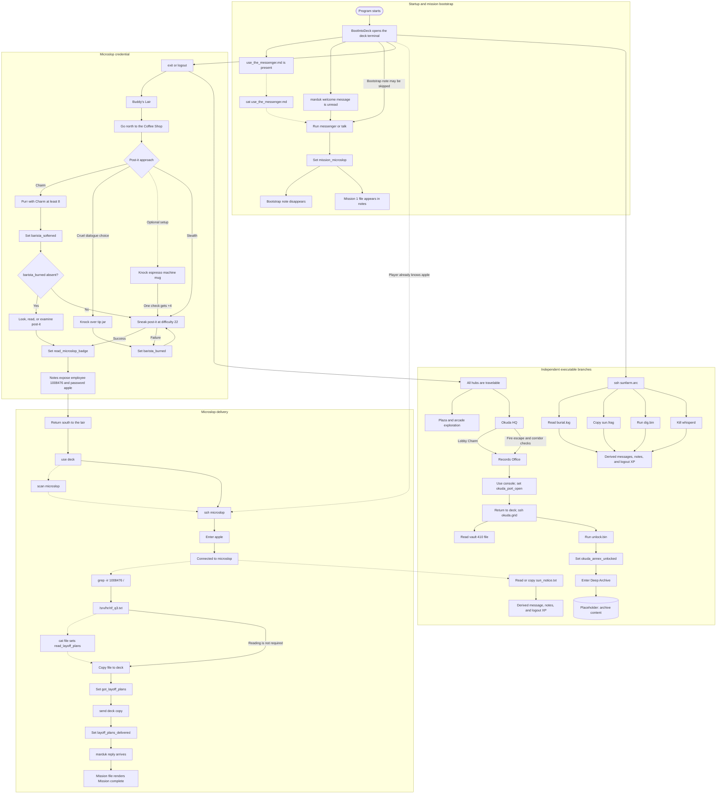

# Game Flow

This is the canonical code-derived map of implemented game behavior. Update
it in the same change as any game-logic change. Solid arrows represent
required state transitions; dashed arrows represent optional actions or
knowledge-based shortcuts that the runtime permits.

## Runtime properties exposed by the diagram

- The bootstrap note and `scan microslop` are guidance, not gates.
- `read_microslop_badge` does not gate SSH; knowing `apple` bypasses the
  coffee-shop route.
- `mission_microslop` does not gate the target file or its hooks, so the
  delivery flags can land before the briefing is read.
- Okuda, sunfarm, and Plaza behavior is independently reachable rather than
  part of Mission 1.
- The Deep Archive is reachable, but its terminal content remains a marked
  placeholder in code.
